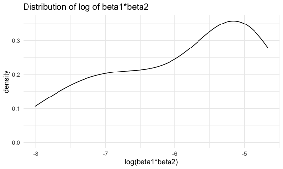
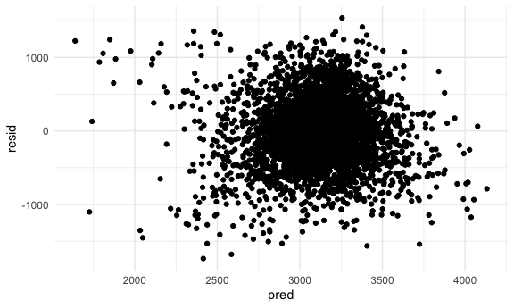
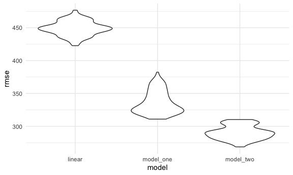

p8105_hw6_ar4459_practice
================
ASHLEY ROMO
2023-11-30

load key packages

``` r
library(tidyverse)
```

    ## ── Attaching core tidyverse packages ──────────────────────── tidyverse 2.0.0 ──
    ## ✔ dplyr     1.1.3     ✔ readr     2.1.4
    ## ✔ forcats   1.0.0     ✔ stringr   1.5.0
    ## ✔ ggplot2   3.4.3     ✔ tibble    3.2.1
    ## ✔ lubridate 1.9.2     ✔ tidyr     1.3.0
    ## ✔ purrr     1.0.2     
    ## ── Conflicts ────────────────────────────────────────── tidyverse_conflicts() ──
    ## ✖ dplyr::filter() masks stats::filter()
    ## ✖ dplyr::lag()    masks stats::lag()
    ## ℹ Use the conflicted package (<http://conflicted.r-lib.org/>) to force all conflicts to become errors

``` r
library(p8105.datasets)
library(modelr)

set.seed(1234)
knitr::opts_chunk$set(
    echo = TRUE,
    warning = FALSE,
  fig.width = 6,
  fig.asp = .6,
  out.width = "90%"
)

theme_set(theme_minimal() + theme(legend.position = "bottom"))

options(
  ggplot2.continuous.colour = "viridis",
  ggplot2.continuous.fill = "viridis"
)

scale_colour_discrete = scale_colour_viridis_d
scale_fill_discrete = scale_fill_viridis_d
```

### Problem 2

``` r
weather_df = 
  rnoaa::meteo_pull_monitors(
    c("USW00094728"),
    var = c("PRCP", "TMIN", "TMAX"), 
    date_min = "2022-01-01",
    date_max = "2022-12-31") |>
  mutate(
    name = recode(id, USW00094728 = "CentralPark_NY"),
    tmin = tmin / 10,
    tmax = tmax / 10) |>
  select(name, id, everything())
```

    ## using cached file: /Users/ashleyromo/Library/Caches/org.R-project.R/R/rnoaa/noaa_ghcnd/USW00094728.dly

    ## date created (size, mb): 2023-10-05 18:05:30.264135 (8.534)

    ## file min/max dates: 1869-01-01 / 2023-10-31

First, I created a bootstrap function.

``` r
# bootstrap function 
boot_sample = function(df) {
  
  sample_frac(df, replace = TRUE)
}
```

Next, I apply the bootsrap function and use broom::glance to calculate
the r square value.

``` r
# apply bootstrap for r square
boot_results_r =
  tibble(strap_number = 1:50) |> 
  mutate(
    strap_sample = map(strap_number, \(i) boot_sample(weather_df)),
    models = map(strap_sample, \(df) lm(tmax ~ tmin + prcp, data = df)),
    results = map(models, broom::glance))|> 
  select(-strap_sample, -models) |> 
    unnest(results) |> 
   janitor::clean_names() 
  
#r.square plot
boot_results_r |> 
  ggplot(aes(x = r_squared)) +
  geom_density() +
  labs(
    x = "R Squared",
    y = "Density",
    title = "Distribution of R Squared"
  )
```


The r square plot is unimodal. The max r squared is 0.9385048.

Now, I apply the bootstrap function to the data frame and use the
broom::tidy function to calculate the beta estimates. I use pivot_wider
to isolate the values for tmin and prcp and also rename tmin to beta1
and prcp to beta2. I use mutate to calculate the log of beta1 times
beta2. Lastly, I use ggplot to plot the distribution of
log(beta1\*beta2).

``` r
# apply bootstrap for log(b1*b2)
boot_results_beta =
  tibble(strap_number = 1:50) |> 
  mutate(
    strap_sample = map(strap_number, \(i) boot_sample(weather_df)),
    models = map(strap_sample, \(df) lm(tmax ~ tmin + prcp, data = df)),
    results = map(models, broom::tidy))|> 
    unnest(results) |> 
  janitor::clean_names() |> 
  select(strap_number, term, estimate) |> 
  pivot_wider(
    names_from = term,
    values_from = estimate) |> 
  rename(
    beta1 = tmin,
    beta2 = prcp) |> 
  mutate(
    log_betas = log(beta1*beta2)) |> 
  drop_na()

#plot for log betas
boot_results_beta |> 
  ggplot(aes(x = log_betas)) +
  geom_density() +
  labs(
    x = "log(beta1*beta2)",
    y = "density",
    title = "Distribution of log of beta1*beta2")
```



Now, I calculate the 95% confidence interval for the log(beta1\*beta2)
and the r squared.

``` r
#95% confidence interval for r square
boot_results_r |> 
  summarize(
    ci_lower_est = quantile(r_squared, 0.025),
    ci_upper_est = quantile(r_squared, 0.0975)) |> 
  knitr::kable(digits = 2)
```

| ci_lower_est | ci_upper_est |
|-------------:|-------------:|
|         0.89 |          0.9 |

``` r
#95% confidence interval for log(beta1*beta2)
boot_results_beta |> 
  summarize(
    ci_lower_est = quantile(log_betas, 0.025),
    ci_upper_est = quantile(log_betas, 0.0975)) |> 
  knitr::kable(digits = 2)
```

| ci_lower_est | ci_upper_est |
|-------------:|-------------:|
|         -7.8 |        -7.38 |

### Problem 3

``` r
#data cleaning
bw_data = 
  read_csv("data/birthweight.csv") |> 
  drop_na()
```

    ## Rows: 4342 Columns: 20
    ## ── Column specification ────────────────────────────────────────────────────────
    ## Delimiter: ","
    ## dbl (20): babysex, bhead, blength, bwt, delwt, fincome, frace, gaweeks, malf...
    ## 
    ## ℹ Use `spec()` to retrieve the full column specification for this data.
    ## ℹ Specify the column types or set `show_col_types = FALSE` to quiet this message.

``` r
#propose a linear regression model
linear_mod = lm(bwt ~ delwt + gaweeks + pnumlbw + ppwt + wtgain , data = bw_data) 


#plotting predictions (fitted) and residual values 
bw_data  |> 
  modelr::add_predictions(linear_mod) |>
  modelr::add_residuals(linear_mod) |> 
  ggplot(aes(x = pred, y = resid)) + 
  geom_point() 
```



Compare model to two other ones

``` r
#model 1
model_one = lm(bwt ~ blength + gaweeks, data = bw_data)

#model 2
model_two = lm(bwt ~ bhead + blength + babysex + bhead*blength + bhead*babysex + blength*babysex + bhead*blength*babysex, data = bw_data)
```

Cross Validation

``` r
cv_df = 
  bw_data |> 
  crossv_mc(n = 100) |> 
  mutate(
    train = map(train, as_tibble),
    test = map(test, as_tibble)
  )

# cross validation on three different models
cv_results =
  cv_df|> 
  mutate(
    linear_mod = map(train, ~lm(bwt ~ delwt + gaweeks + pnumlbw + ppwt + wtgain, data = .x)),
    model_one = map(train, ~lm(bwt ~ blength + gaweeks,  data = .x)),
    model_two = map(train, ~lm(bwt ~ bhead + blength + babysex + bhead*blength + bhead*babysex + blength*babysex + bhead*blength*babysex, data = .x))) |> 
  mutate(
    rmse_linear = map2_dbl(linear_mod, test, \(mod, df) rmse(mod, df)),
    rmse_model_one = map2_dbl(model_one, test, \(mod, df) rmse(mod, df)),
    rmse_model_two = map2_dbl(model_two, test, \(mod, df) rmse(mod, df))
  ) 

cv_results_rmse =
  cv_results |> 
  select(.id, rmse_linear, rmse_model_one, rmse_model_two) |> 
  pivot_longer(
    rmse_linear:rmse_model_two,
    names_to = "model",
    names_prefix = "rmse_",
    values_to = "rmse") 

# plot of rmse values for linear model, model one, and model two
cv_results_rmse |> 
  group_by(model) |> 
  ggplot(aes(x = model, y = rmse)) +
  geom_violin()
```


