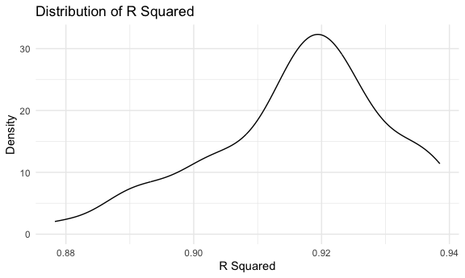

p8105_hw6_ar4459_practice
================
ASHLEY ROMO
2023-11-30

load key packages

``` r
library(tidyverse)
```

    ## ── Attaching core tidyverse packages ──────────────────────── tidyverse 2.0.0 ──
    ## ✔ dplyr     1.1.3     ✔ readr     2.1.4
    ## ✔ forcats   1.0.0     ✔ stringr   1.5.0
    ## ✔ ggplot2   3.4.3     ✔ tibble    3.2.1
    ## ✔ lubridate 1.9.2     ✔ tidyr     1.3.0
    ## ✔ purrr     1.0.2     
    ## ── Conflicts ────────────────────────────────────────── tidyverse_conflicts() ──
    ## ✖ dplyr::filter() masks stats::filter()
    ## ✖ dplyr::lag()    masks stats::lag()
    ## ℹ Use the conflicted package (<http://conflicted.r-lib.org/>) to force all conflicts to become errors

``` r
library(p8105.datasets)
library(modelr)

set.seed(1234)
knitr::opts_chunk$set(
    echo = TRUE,
    warning = FALSE,
  fig.width = 6,
  fig.asp = .6,
  out.width = "90%"
)

theme_set(theme_minimal() + theme(legend.position = "bottom"))

options(
  ggplot2.continuous.colour = "viridis",
  ggplot2.continuous.fill = "viridis"
)

scale_colour_discrete = scale_colour_viridis_d
scale_fill_discrete = scale_fill_viridis_d
```

### Problem 1

In the data cleaning code below we create a `city_state` variable,
change `victim_age` to numeric, modifiy victim_race to have categories
white and non-white, with white as the reference category, and create a
`resolution` variable indicating whether the homicide is solved. Lastly,
we filtered out the following cities: Tulsa, AL; Dallas, TX; Phoenix,
AZ; and Kansas City, MO; and we retained only the variables
`city_state`, `resolution`, `victim_age`, `victim_sex`, and
`victim_race`.

``` r
homicide_df = 
  read_csv("data/homicide-data.csv", na = c("", "NA", "Unknown")) |> 
  mutate(
    city_state = str_c(city, state, sep = ", "),
    victim_age = as.numeric(victim_age),
    resolution = case_when(
      disposition == "Closed without arrest" ~ 0,
      disposition == "Open/No arrest"        ~ 0,
      disposition == "Closed by arrest"      ~ 1)
  ) |> 
  filter(victim_race %in% c("White", "Black")) |> 
  filter(!(city_state %in% c("Tulsa, AL", "Dallas, TX", "Phoenix, AZ", "Kansas City, MO"))) |> 
  select(city_state, resolution, victim_age, victim_sex, victim_race)
```

    ## Rows: 52179 Columns: 12
    ## ── Column specification ────────────────────────────────────────────────────────
    ## Delimiter: ","
    ## chr (8): uid, victim_last, victim_first, victim_race, victim_sex, city, stat...
    ## dbl (4): reported_date, victim_age, lat, lon
    ## 
    ## ℹ Use `spec()` to retrieve the full column specification for this data.
    ## ℹ Specify the column types or set `show_col_types = FALSE` to quiet this message.

Next we fit a logistic regression model using only data from Baltimore,
MD. We model `resolved` as the outcome and `victim_age`, `victim_sex`,
and `victim_race` as predictors. We save the output as `baltimore_glm`
so that we can apply `broom::tidy` to this object and obtain the
estimate and confidence interval of the adjusted odds ratio for solving
homicides comparing non-white victims to white victims.

``` r
baltimore_glm = 
  filter(homicide_df, city_state == "Baltimore, MD") |> 
  glm(resolution ~ victim_age + victim_sex + victim_race, family = binomial(), data = _)

baltimore_glm |> 
  broom::tidy() |> 
  mutate(
    OR = exp(estimate), 
    OR_CI_upper = exp(estimate + 1.96 * std.error),
    OR_CI_lower = exp(estimate - 1.96 * std.error)) |> 
  filter(term == "victim_sexMale") |> 
  select(OR, OR_CI_lower, OR_CI_upper) |>
  knitr::kable(digits = 3)
```

|    OR | OR_CI_lower | OR_CI_upper |
|------:|------------:|------------:|
| 0.426 |       0.325 |       0.558 |

Below, by incorporating `nest()`, `map()`, and `unnest()` into the
preceding Baltimore-specific code, we fit a model for each of the
cities, and extract the adjusted odds ratio (and CI) for solving
homicides comparing non-white victims to white victims. We show the
first 5 rows of the resulting dataframe of model results.

``` r
model_results = 
  homicide_df |> 
  nest(data = -city_state) |> 
  mutate(
    models = map(data, \(df) glm(resolution ~ victim_age + victim_sex + victim_race, 
                             family = binomial(), data = df)),
    tidy_models = map(models, broom::tidy)) |> 
  select(-models, -data) |> 
  unnest(cols = tidy_models) |> 
  mutate(
    OR = exp(estimate), 
    OR_CI_upper = exp(estimate + 1.96 * std.error),
    OR_CI_lower = exp(estimate - 1.96 * std.error)) |> 
  filter(term == "victim_sexMale") |> 
  select(city_state, OR, OR_CI_lower, OR_CI_upper)

model_results |>
  slice(1:5) |> 
  knitr::kable(digits = 3)
```

| city_state      |    OR | OR_CI_lower | OR_CI_upper |
|:----------------|------:|------------:|------------:|
| Albuquerque, NM | 1.767 |       0.831 |       3.761 |
| Atlanta, GA     | 1.000 |       0.684 |       1.463 |
| Baltimore, MD   | 0.426 |       0.325 |       0.558 |
| Baton Rouge, LA | 0.381 |       0.209 |       0.695 |
| Birmingham, AL  | 0.870 |       0.574 |       1.318 |

Below we generate a plot of the estimated ORs and CIs for each city,
ordered by magnitude of the OR from smallest to largest. From this plot
we see that most cities have odds ratios that are smaller than 1,
suggesting that crimes with male victims have smaller odds of resolution
compared to crimes with female victims after adjusting for victim age
and race. This disparity is strongest in New yrok. In roughly half of
these cities, confidence intervals are narrow and do not contain 1,
suggesting a significant difference in resolution rates by sex after
adjustment for victim age and race.

``` r
model_results |> 
  mutate(city_state = fct_reorder(city_state, OR)) |> 
  ggplot(aes(x = city_state, y = OR)) + 
  geom_point() + 
  geom_errorbar(aes(ymin = OR_CI_lower, ymax = OR_CI_upper)) + 
  theme(axis.text.x = element_text(angle = 90, hjust = 1))
```


### Problem 2

``` r
weather_df = 
  rnoaa::meteo_pull_monitors(
    c("USW00094728"),
    var = c("PRCP", "TMIN", "TMAX"), 
    date_min = "2022-01-01",
    date_max = "2022-12-31") |>
  mutate(
    name = recode(id, USW00094728 = "CentralPark_NY"),
    tmin = tmin / 10,
    tmax = tmax / 10) |>
  select(name, id, everything())
```

    ## using cached file: /Users/ashleyromo/Library/Caches/org.R-project.R/R/rnoaa/noaa_ghcnd/USW00094728.dly

    ## date created (size, mb): 2023-10-05 18:05:30.264135 (8.534)

    ## file min/max dates: 1869-01-01 / 2023-10-31

First, I created a bootstrap function.

``` r
# bootstrap function 
boot_sample = function(df) {
  
  sample_frac(df, replace = TRUE)
}
```

Next, I apply the bootsrap function and use broom::glance to calculate
the r square value.

``` r
# apply bootstrap for r square
boot_results_r =
  tibble(strap_number = 1:50) |> 
  mutate(
    strap_sample = map(strap_number, \(i) boot_sample(weather_df)),
    models = map(strap_sample, \(df) lm(tmax ~ tmin + prcp, data = df)),
    results = map(models, broom::glance))|> 
  select(-strap_sample, -models) |> 
    unnest(results) |> 
   janitor::clean_names() 
  
#r.square plot
boot_results_r |> 
  ggplot(aes(x = r_squared)) +
  geom_density() +
  labs(
    x = "R Squared",
    y = "Density",
    title = "Distribution of R Squared"
  )
```


The r square plot is unimodal. The max r squared is 0.9385048.

Now, I apply the bootstrap function to the data frame and use the
broom::tidy function to calculate the beta estimates. I use pivot_wider
to isolate the values for tmin and prcp and also rename tmin to beta1
and prcp to beta2. I use mutate to calculate the log of beta1 times
beta2. Lastly, I use ggplot to plot the distribution of
log(beta1\*beta2).

``` r
# apply bootstrap for log(b1*b2)
boot_results_beta =
  tibble(strap_number = 1:50) |> 
  mutate(
    strap_sample = map(strap_number, \(i) boot_sample(weather_df)),
    models = map(strap_sample, \(df) lm(tmax ~ tmin + prcp, data = df)),
    results = map(models, broom::tidy))|> 
    unnest(results) |> 
  janitor::clean_names() |> 
  select(strap_number, term, estimate) |> 
  pivot_wider(
    names_from = term,
    values_from = estimate) |> 
  rename(
    beta1 = tmin,
    beta2 = prcp) |> 
  mutate(
    log_betas = log(beta1*beta2)) |> 
  drop_na()

#plot for log betas
boot_results_beta |> 
  ggplot(aes(x = log_betas)) +
  geom_density() +
  labs(
    x = "log(beta1*beta2)",
    y = "density",
    title = "Distribution of log of beta1*beta2")
```


Using the quintile function, I calculate the 95% confidence interval for
the log(beta1\*beta2) and the r squared.

``` r
#95% confidence interval for r square
r_ci =
  boot_results_r |> 
  summarize(
    ci_lower_est = quantile(r_squared, 0.025),
    ci_upper_est = quantile(r_squared, 0.0975)) |> 
  knitr::kable(digits = 2)

#95% confidence interval for log(beta1*beta2)
log_ci =
  boot_results_beta |> 
  summarize(
    ci_lower_est = quantile(log_betas, 0.025),
    ci_upper_est = quantile(log_betas, 0.0975)) |> 
  knitr::kable(digits = 2)
```

### Problem 3

First, I load the data and drop any missing values.

``` r
#data cleaning
bw_data = 
  read_csv("data/birthweight.csv") |> 
  drop_na()
```

    ## Rows: 4342 Columns: 20
    ## ── Column specification ────────────────────────────────────────────────────────
    ## Delimiter: ","
    ## dbl (20): babysex, bhead, blength, bwt, delwt, fincome, frace, gaweeks, malf...
    ## 
    ## ℹ Use `spec()` to retrieve the full column specification for this data.
    ## ℹ Specify the column types or set `show_col_types = FALSE` to quiet this message.

Next, I propose a linear model. I chose to include variables that are
associated with birthweight. These variables are delwt, gaweeks,
pnumlbw, ppwt, and wtgain.

``` r
#propose a linear regression model
linear_mod = lm(bwt ~ delwt + gaweeks + pnumlbw + ppwt + wtgain , data = bw_data) 
```

Next, I use modelr::add_predictions and modelr::add_residuals to
calculate and then plot the predicted values against the residual values

``` r
#plot predictions (fitted) and residual values 
bw_data  |> 
  modelr::add_predictions(linear_mod) |>
  modelr::add_residuals(linear_mod) |> 
  ggplot(aes(x = pred, y = resid)) + 
  geom_point() 
```


Here, I listed the two models according to the homework description.

``` r
#model 1
model_one = lm(bwt ~ blength + gaweeks, data = bw_data)

#model 2
model_two = lm(bwt ~ bhead + blength + babysex + bhead*blength + bhead*babysex + blength*babysex + bhead*blength*babysex, data = bw_data)
```

Cross Validation

``` r
#use crosv_mc to do the crossvaludation on the train and test 
cv_df = 
  bw_data |> 
  crossv_mc(n = 100) |> 
  mutate(
    train = map(train, as_tibble),
    test = map(test, as_tibble)
  )

# cross validation on three different models
cv_results =
  cv_df|> 
  mutate(
    linear_mod = map(train, ~lm(bwt ~ delwt + gaweeks + pnumlbw + ppwt + wtgain, data = .x)),
    model_one = map(train, ~lm(bwt ~ blength + gaweeks,  data = .x)),
    model_two = map(train, ~lm(bwt ~ bhead + blength + babysex + bhead*blength + bhead*babysex + blength*babysex + bhead*blength*babysex, data = .x))) |> 
  mutate(
    rmse_linear = map2_dbl(linear_mod, test, \(mod, df) rmse(mod, df)),
    rmse_model_one = map2_dbl(model_one, test, \(mod, df) rmse(mod, df)),
    rmse_model_two = map2_dbl(model_two, test, \(mod, df) rmse(mod, df))
  ) 

cv_results_rmse =
  cv_results |> 
  select(.id, rmse_linear, rmse_model_one, rmse_model_two) |> 
  pivot_longer(
    rmse_linear:rmse_model_two,
    names_to = "model",
    names_prefix = "rmse_",
    values_to = "rmse") 

# plot of rmse values for linear model, model one, and model two
cv_results_rmse |> 
  group_by(model) |> 
  ggplot(aes(x = model, y = rmse)) +
  geom_violin()
```


